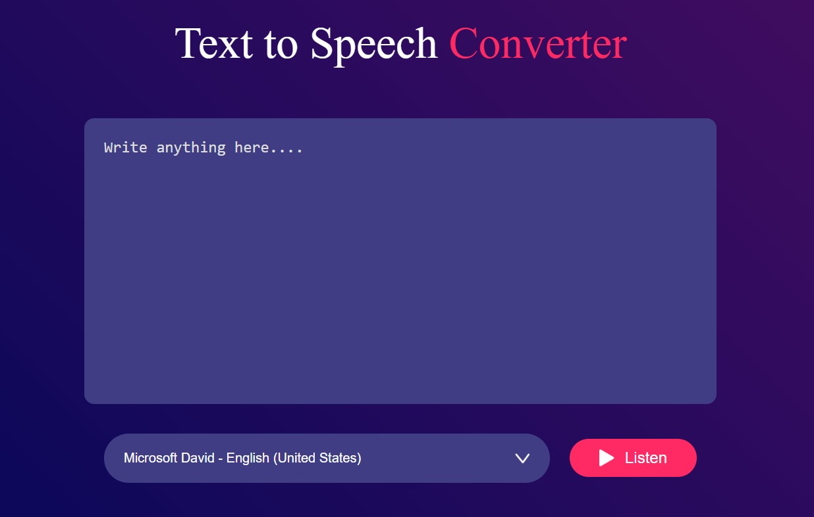

## 🗣️ Text to Speech Converter  

A simple and interactive **Text to Speech Converter** built using HTML, CSS, and JavaScript. This tool allows users to convert typed text into speech with different voice options.  

## 🚀 Features  
- ✅ Convert text into speech instantly  
- ✅ Choose from different voice options (e.g., USA, UK)  
- ✅ Simple text area for input  
- ✅ Play button to listen to the speech  
- ✅ Responsive and easy-to-use interface  

## 🛠 Tech Stack  
HTML, CSS, JavaScript  

## 📷 Screenshots  
  

## 📌 How to Use  
1. Enter text into the text area.  
2. Select your preferred voice (e.g., USA, UK).  
3. Click the "Play" button to hear the text spoken aloud.  

## 📥 Download & Installation  
Clone the repository using Git:  
```bash
git clone https://github.com/aklema094/Text-to-Voice.git
```  
Or download the ZIP file manually from [here](https://github.com/aklema094/Text-to-Voice/archive/refs/heads/main.zip).  

 